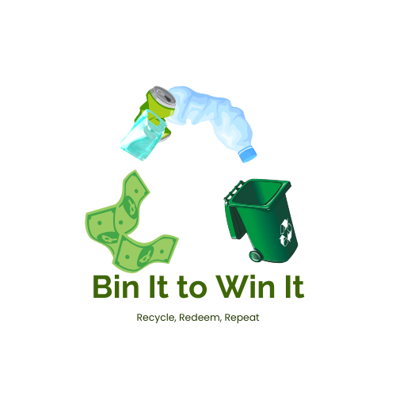

  

# Bin It To Win It: A Smart Waste Reduction Management for a Sustainable Future

[Aldriena Faye A. Manalo](https://github.com/yenamnl)   
IT-2104

### Table of Contents 
I. Project Overview  
II. Application of Python Concepts and Libraries  
III. Integration of Sustainable Development Goals (SDGs)  
IV. Instructions in Running the Program

### I.  Project Overview 🔍 
>***Bin It To Win It*** encourages proper waste disposal and recycling. The project focuses on providing residents with a simple and efficient way to manage their waste, track their recycling efforts, and earn discounts for their environmentally conscious actions. The program allows residents to register, log in, add recyclable waste, calculate discounts based on the amount and type of waste added, and display a summary of their efforts. The program also provides helpful tips on waste sorting and reduction, contributing to environmental sustainability.

### II. Application of Python Concepts and Libraries 🐍
In this section, Python concepts and libraries were used to structure and process data to achieve desired outcomes including:

**Libraries**
>The `json` library is used to enable writing and reading  to JSON files, which helps in storing resident data persistently between program sessions. `sys` to exit the program when the user wants to “Exit”.  And ‘datetime’ to record the current date and time in the waste management summary

**Classes** 
>The **`Resident Class`** represents an individual resident in the system. It has attributes such as `name` , `house_number `, `zone` , `waste_added`, `recycling_discount`, `total_payment`, and `waste_log`. The `__init__` method initializes these attributes, setting default values for `waste_added`, `recycling_discount`, `total_payment`, and an empty list for `waste_log` and **`BinItToWinIt Class`** the  main class which organizes the application's functionalities and methods. It holds a list of registered residents `self.residents` and a dictionary `self.zones` that maps zones to their corresponding collection days.

**Data Handling**
>*Loading Data*: When the program starts, it attempts to load resident data from a `residents.json` file, creating a fresh start if no file exists. Each resident's information (like name, house number, and zone) is read from the `JSON` file and used to create Resident objects, which are added to a list.

>*Saving Data*:  Throughout the program, any new or updated resident data is saved by converting each Resident object into a dictionary and writing this data back into the `residents.json` file. This allows the system to retain residents' details and waste logs, even if the program is closed and reopened later.

**Error Handling**
>*File Not Found*: In load_residents(), the code tries to open a `JSON` file to load resident data. If the file doesn’t exist, a FileNotFoundError is caught, and a message informs the user that the system will start fresh.

>*Input Validation*: The code uses `try-except` blocks to handle errors and ensure smooth user interactions. For zone selection during registration, the `try-except` block catches invalid inputs, like non-numeric values, preventing crashes and prompting the user to enter a valid number. Similarly, when entering waste amounts or payment values, `try-except` blocks are employed to ensure that only valid numerical inputs are accepted.

>*Menu Choice Validation* : In main_menu() and resident_menu(), choices that don’t correspond to available options prompt the user to try again, ensuring the program flow remains controlled and error-free.

**Loops**
>This code uses several types of loops to ensure continuous access, validation, and processing of data.
The main_menu() and resident_menu() functions employ `while True` loops to repeatedly display options until the user chooses to exit or log out.

>Within register_resident(), select_waste_item(), input_waste_amount(), and calculate_discount(), `while` loops validate user input, prompting repeatedly for valid entries (e.g., correct zone number, valid waste item selection, non-negative waste amount, and payment before discounts).

>In add_waste(), a while loop allows residents to add multiple waste items in one session, and in calculate_discount(), a `for` loop iterates over the resident's waste log to accumulate recycling discounts. Another for loop in display_summary() displays each waste log entry for a summary.

**Lists**
>The `self.residents` list holds all registered residents, with each resident represented by an instance of the `Resident` class. This allows the system to manage multiple residents and their information. Each resident’s waste activities are tracked in the `resident.waste_log` list, where every entry records the type of waste, the specific item, and the amount added. The `recyclable_items’  list contains predefined waste items (such as "Plastic", "Paper", "Metal", and "Glass") from which residents can choose when adding waste.

**Dictionaries**
>The `self.zones` dictionary maps each zone number (1 to 6) to its corresponding collection days, with the zone number as the key and a list of collection days as the value. When resident data is loaded from a JSON file in the `load_residents `method, it is stored in dictionaries, where keys represent attributes like "name", "house_number", and "zone", and the values hold the corresponding data. Additionally, each entry in the `resident.waste_log` list is a dictionary that records the details of a specific waste item, including the waste type, item name, and the amount added.

**Displaying Output**
>The `print()` function is employed in various places to display messages, such as welcoming the resident, showing instructions, or displaying a summary. The use of formatted strings, especially with f-strings (e.g. `print(f"Total Recyclable Waste Added: {resident.waste_added:.2f} kg"`)), ensures that the output is both readable and precise. The `.2f` inside the f-string limits the displayed number to two decimal places, which is particularly useful when showing amounts like weights and monetary values.  

>When presenting lists or multiple items, `", ".join()` is used to join values with commas (e.g., `print(f"Collection Days: {', '.join(self.zones[resident.zone])}"`)), making the list easy to read. Throughout the code, the` print(`) function is employed to guide users through the system, 

### III. Integration of Sustainable Development Goals (SDGs) 🌱
>**Sustainable Development Goal (SDG) 12: Responsible Consumption and Production** emphasizes the importance of reducing waste generation, managing waste effectively, and promoting sustainable practices. The ***BinItToWinIt*** encourages residents to recycle by offering incentives through recycling discounts, motivating them to reduce their waste footprint. Additionally, it provides educational resources on waste sorting, including how to properly separate recyclables and non-recyclables, which helps foster environmentally responsible behavior among the community.

### IV. Instructions in Running the Program ▶️  
>To run the Bin It To Win It program, follow the steps:

>***1. Starting the Program***  
 > - Upon starting, you will see a **main menu** with options to:  
 >**1. Register**  
 >**2. Login**  
 >**3. Exit**  
 >Choose the desired option and follow the prompts.

>***2. Registering a Resident***  
 >**Choose an option: `1`** (Register Resident)  
 >**Enter name:**  
 >**Enter house number:**  
 >**Enter zone (1-6):**  
 >"Resident's name" **registered successfully!**

>After Registering, the system stores resident data in a `residents.json` file.
>If files exists, resident data will be loaded automatically. 

>***3. Logging in***  
>**Choose an option: `2`**(Login)  
>**Enter house number:**  
 >**Welcome back,** “Resident’s name”**!**  

>After Logging in, the **Resident Options** will be displayed.  
>**1. Show Collection Days**  
>**2. Show Instructions and Reduction Tips**  
>**3. Add Waste**  
>**4. Calculate Recycling Discount**  
>**5. Display Summary**  
>**6. Logout**  
>Choose the desired option (use the number equivalent with each option).

>***4. Viewing Collection Days***  
>**Choose an option: `1`** (Show Collection Days) 
>**Your Collection Days are:** (Depends on what zone the resident at)

>***5. Viewing Waste Sorting Instructions and Reduction Tips***  
>**Choose an option: `2`** (Show Instruction and Reduction Tips)  
>The waste sorting instructions and reduction tips will be displayed

>***6. Adding Waste***  
>**Choose an option: `3`** (Add Waste)  
>**Select a recyclable item:**
>1. Plastic
>2. Paper
>3. Metal
>4. Glass  

>**Choose an item number:** (Enter number of the recyclable item)  
>**Enter the amount of** (item number) **added (in kg):**

>***7. Calculating Recycling Discount***  
>**Choose an option: `4`** (Calculate Recycling Discount)  
>**Enter total payment (before discount):** (Total Payment before discount in Peso)  
>**Recycling discount:**

>***8. Displaying Summary***  
>**Choose an option: `5`** (Display Summary)  
>Shows the resident details, collection Days, total recyclable waste added, Recycling Discount, Final Payment After Discount, date and time, and waste log.

>***9. Logging Out***  
>**Choose an option: `6`** (Logout)  
>Logging out.

>After Logging Out, the **`main menu`** will be displayed again.  
>The user can either Register and Login again and when the user wants to Exit the program choose option **`3`** and the data will be saved automatically.

    

       

